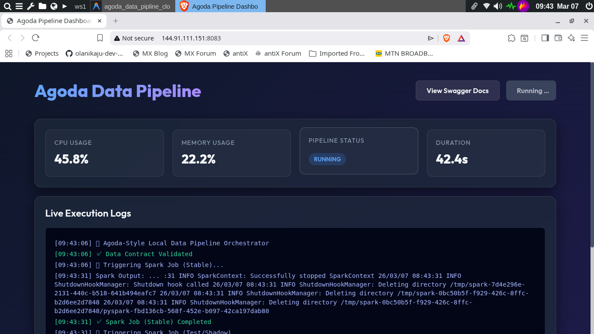

# 🚀 Agoda-Style Local-First Data Pipeline

[](https://go.dev/)
[](https://spark.apache.org/)
[](https://www.postgresql.org/)

A high-performance, **zero-cost** data ecosystem running entirely on your local machine. This project replicates the architectural complexity of a billion-dollar company (Agoda) using open-source, local-first tools.

---

## 🏗️ Architecture: The "Cloud" vs. The "Free Way"

| Cloud Component | Local-First Equivalent | Purpose |
| :--- | :--- | :--- |
| **AWS Step Functions** | `main.go` (Go Orchestrator) | Decides *when* and *what* to run. |
| **AWS Glue / EMR** | Apache Spark (Docker) | Processes millions of rows using distributed logic. |
| **Amazon S3** | `./data` (Standard Folders) | Simulates a Data Lake with raw and processed zones. |
| **Amazon Redshift** | PostgreSQL (Docker) | The final destination for structured reports. |
| **Data Contracts** | `schema.json` | Ensures every team uses the same math. |
| **Shadow Testing** | `./data/test/` comparison | Validates new code logic without breaking production. |

---

## 🧪 Core Engineering Principles

### 1. The Data Contract (`schema.json`)
Before any data moves, the Go orchestrator validates it. If a "Financial Record" misses an `amount`, the pipeline halts immediately. This prevents "Garbage In, Garbage Out."

### 2. Shadow Testing (The Safety Net)
Whenever you change your Spark logic:
1. The orchestrator runs the **Stable** version (Production).
2. It runs your **Test** version in parallel.
3. It compares the results. If the revenue difference is > 0.1%, it sends a massive alert to your OS.

### 3. The Watchdog (Data Freshness)
In a real business, stale data is lost money. The Go app checks the file timestamps. If they are older than 1 hour, it triggers a system notification using `libnotify`.

---

## 🛠️ Usage Guide

### 1. Boot the Mini Data Center
```bash
make up
```

### 2. Generate Real-World Chaos
```bash
make generate
```

### 3. Execute the Full Cycle
```bash
make run
```

### 4. Live Production Dashboard
The Agoda Data Pipeline is fully deployed and running live in production!

**🔗 Access the Dashboard:** [http://144.91.111.151:8083](http://144.91.111.151:8083)

#### What is this website?
This dashboard serves as the central command center for the pipeline:
1. **The Orchestrator:** A high-performance Go backend that triggers the distributed Apache Spark jobs, enforces the `schema.json` data contracts, and manages the shadow testing parallel runs.
2. **Real-Time Monitoring:** The UI connects directly to the server to stream live execution logs, monitor infrastructure CPU/Memory utilization, and benchmark pipeline execution durations in real-time.
3. **API Access:** It also provides full Swagger API documentation at `/swagger/index.html` for headless programmatic access.



---

## 📂 Project Structure
- `main.go`: The central orchestrator.
- `jobs/transform.py`: The PySpark transformation script.
- `schema.json`: The source of truth for data structures.
- `data/`: The local Data Lake (Raw, Stable, Test).
- `Makefile`: Entry points for all operations.

---

> "Logic is free. Infrastructure doesn't have to be expensive."
